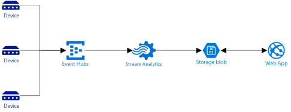

Overview
--------

The purpose of this project is to demonstrate a simple home monitoring solution, measuring tempurature, humidity, and heating zone activity. This data is processed via Azure [EventHubs](https://azure.microsoft.com/en-us/services/event-hubs/) and [Stream Analytics](https://azure.microsoft.com/en-us/services/stream-analytics/), and presented via a simple web interface.

High-level Architecture
-----------------------

There are 3 main pieces to this system:

+ Local agent to to simulate connected sensors and send data.
+ Stream Analytics transform job to window the data streams.
+ Web application to display real-time updates of windowed data.

Web Interface
--------

Here's a screenshot of the web application in action:

